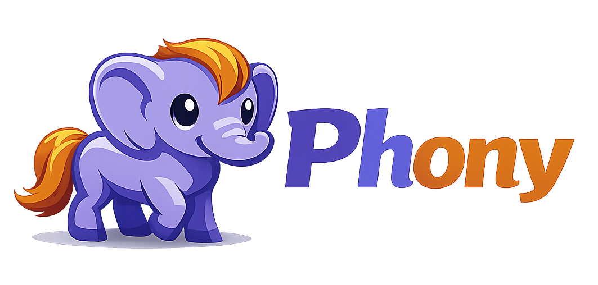

    <a href="https://wayof.dev" target="_blank">
        <picture>
            <source media="(prefers-color-scheme: dark)" srcset="assets/logo.png">
            
        </picture>
    </a>

    <strong>Build</strong> 
    

    <strong>Project</strong> 
    
    
    
    

    <strong>Quality</strong> 
    
    
    

    <strong>Community</strong> 
    
    

 

# Phony: All in one PHP toolchain

This package @todo
